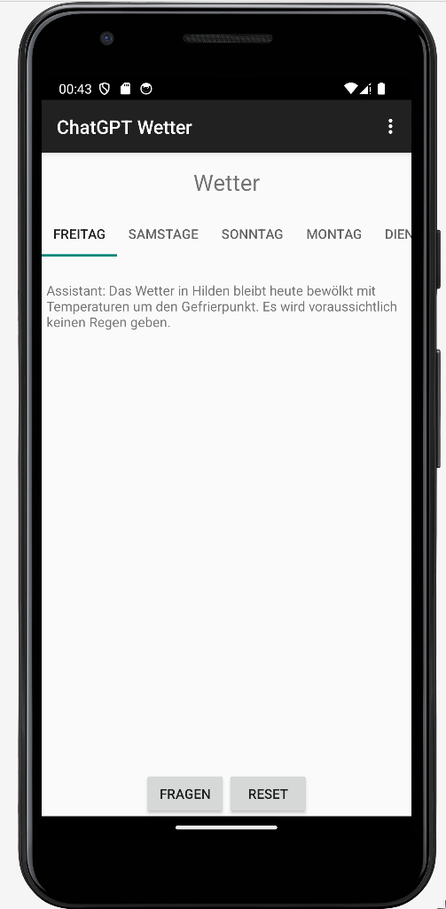
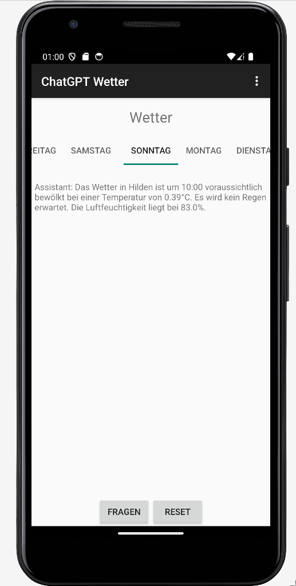
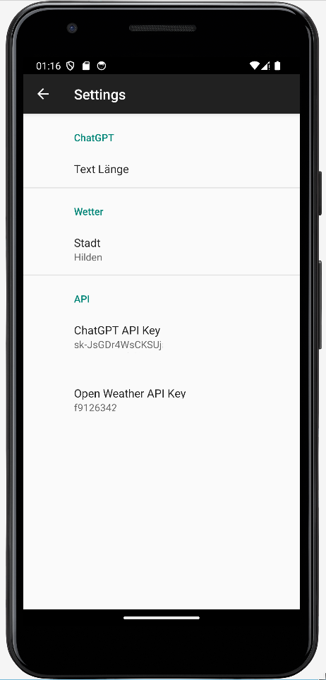

## Einleitung
Meine Erweiterung fügt einen Wetterbericht von ChatGPT für die nächsten fünf Tage der App hinzu. Der Benutzer kann zudem ChatGPT weiter fragen über das Wetter für jeden Tag individuell fragen.

## Anforderungen
In der App sollen Wetterberichte von ChatGPT für die nächsten fünf Tage dargestellt werden. Der Wetterbericht für den Tag soll als erstes angezeigt werden. Dafür müssen die Wetterdaten von der OpenWeatherMap-API abgefragt und an ChatGPT übergeben werden. Sobald ein anderer Tag von dem Benutzer aufgerufen wird soll ein Wetterbericht für den Tag von ChatGPT generiert werden. Der Benutzer soll zudem die Möglichkeit haben den Chat zurückzusetzen also einen neuen Wetterbericht generieren zu lassen. Zudem sollen die Chats mit den Wetterberichten für jeden Tag individuell sein, so das verschiedene Sachen über das Wetter gefragt werden können, wie z.B.: "Welche Aktivität würdest du bei dem Wetter empfehlen". Des Weiteren soll man ungefähr die Länge (kurz, mittel, lang) der Antwort von ChatGPT in den Einstellungen einstellen können. Zuletzt soll ein Indikator angezeigt werden während ChatGPT antwortet.

## Umsetzung
#### Design/Layout
Zur Darstellung der Wetterberichte habe ich ein `TabLayout` mit einem `ViewPager2` genutzt. In dem `ViewPager2` wird immer entsprechend zu dem ausgewählten Tab ein `DayFragment` angezeigt. Das `DayFragment` ist ein eigenes Fragment, welches nur eine `ProgressBar` und eine `ScrollView` mit einer `TextView` beinhaltet, um den Chat verlauf anzuzeigen. Für die Generierung der Tabs in dem `TabLayout` habe ich den `TabLayoutMediator` verwendet, welcher die Tabs nach den vorgegebenen Kriterien automatisch erstellt. Mit Hilfe des `FragmentStateAdapter` werden auch automatisch die angezeigten `DayFragemt`s in dem `ViewPager2`  erstellt. Zuletzt habe ich in den Einstellungen eine `ListPrefernce` hinzugefügt, um die Länge des Wetterberichts einstellen zu können. Sowie zwei `EditTextPrefernce` einmal für die Stadt und einmal für den OpenWeatherMap-API Key.
<table border="0">
    <tr>
        <td>
            
        </td>
        <td>
            
        </td>
        <td>
            
        </td>
    </tr>
</table>

#### OpenWeatherMap
Für die Kommunikation mit der OpenWeatherMap-API habe ich die Klasse `OpenWeatherMap` angelegt. Zu Testzwecken habe ich auch eine `MockOpenWeatherMap` Klasse hinzugefügt, um nicht jedes Mal eine Anfrage an die OpenWeatherMap-API zu senden. Als Schnittstelle für andere Klassen gibt es die Methode ` CompletableFuture<List<Weather>> getWeather(dayOfWeek)`. Mit dieser Methode lassen sich die Wetterdaten in Form einer `List` mit dem Datentyp `Weather`  für einen bestimmten Wochentag zurückgeben. Die Klasse `Weather` ist eine eigene Klasse, welche Informationen über das Wetter zu einer bestimmten Uhrzeit speichert. Zudem werden die Daten von der API gecached. Nach ein paar Minuten oder wenn sich die Stadt ändert wird der cache invalidiert. Mit Hilfe der vorhandenen `URL` und `HttpURLConnection` werden die Anfragen an die OpenWeatherMap-API gesendet. Mit der eingebauten `JSON` library, von Android, werden die Daten dann in die entsprechende Form gebracht und im cache gespeichert.

#### Message
Bei der `Message` Klasse habe ich eine kleine Modifikation hinzugefügt. Ich habe den Parameter `isPrintable` hinzugefügt, um Nachricht zu kennzeichnen, ob sie angezeigt werden sollen oder nicht.  

#### Chat
Auch an dem `Chat` habe ich eine kleine Modifikation vorgenommen. Dort habe ich einen einfachen Parameter namens `hasForcasted` hinzugefügt, welcher angibt, ob von ChatGPT in diesem Chat schon mindestens eine Wettervorhersage enthalten ist.

#### Wetterbericht Generierung 
Um die Wetterberichte zu trennen werden alle Chats in einer Map gespeichert. Sobald die App gestartet wird, wird der Wetterbericht für den Tag generiert. Sobald ein anderer Tab aufgerufen wird, wird für den Tag der Wetterbericht generiert und angezeigt, sofern dieser noch keinen Wetterbericht hat. Zu Generierung eines Wetterberichts werden verschiedene über den Tag verteilte Wetterdaten an ChatGPT über Systemnachrichten übergeben. Mit einer nicht sichtbaren Benutzernachricht wird ChatGPT aufgefordert einen Wetterbericht zu generieren. Dieser wird dann in dem entsprechenden Chat angezeigt und während ChatGPT antwortet wird die `ProgressBar` angezeigt.

## Probleme/Lessons learned
Bei der Umsetzung traten hauptsächlich zwei Probleme auf. Das erste Problem bestand darin, dass der `FragmentStateAdapter` nicht angezeigte Elemente löscht und neue anlegt, wenn diese Benötigt werden. Dadurch wurde der angezeigte Text von den Chats gelöscht, weil die `TextView` eine neue ist. Um das Problem zu lösen, kann man einen `OnPageChangeCallback` auf dem `ViewPager2` hinzufügen. In dem `Callback` kann man dann, wenn nötig den Chat laden. Das  andere Problem bezieht sich auch auf den `ViewPager2`. Beim erstmaligen laden der App wird das `Callback` auf dem `ViewPager2` nicht ausgeführt, wodurch der erste Wetterbericht nicht geladen wird. Um dieses Problem zu beheben, kann man einen `GlobalLayoutListener` auf dem `ViewPager2` registrieren. Sobald dieser Aufgerufen wird, wird der Wetterbericht geladen und der `GlobalLayoutListener` entfernt, da das `Callback` nun den Aufruf eines Tabs verwaltet.

## Fazit
Abgesehen von dem Laden der Chats in dem `TabLayout` lief alles ohne größere Probleme. Zudem konnte ich alles so umsetzten, wie ich es mir vorgestellt hatte und habe auch ungefähr so viel Zeit benötigt, wie vermutet. Zuletzt würden mir noch zwei kleine Erweiterungen/Verbesserungen einfallen. Zum einen könnte man noch die ChatGPT-Prompt etwas verbessern, weil manchmal sehr lange Kommazahlen ausgegeben wurden und zum anderen könnte man noch überprüfen, ob die eingegebene Stadt auch existiert.
